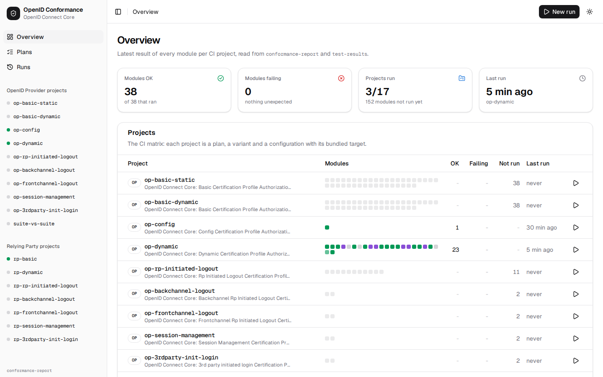

# openid-conformance-suite

[](https://github.com/balazsorban44/openid-conformance-suite/actions/workflows/ci.yml)

A TypeScript port of the [OpenID Foundation conformance suite](https://gitlab.com/openid/Conformance-suite),
driven by [Playwright](https://playwright.dev) and built to run in GitHub Actions. Point it at your OpenID
Provider / OAuth 2.0 authorization server or at your Relying Party / client and get the same checks, the same
log messages and the same spec references as the official suite, as a CI job with a readable summary.

Every upstream test module is one Playwright test that reads like the test it is (`tests/op/*.spec.ts`,
`tests/rp/*.spec.ts`); upstream's conditions are plain functions grouped by concern (`src/op`, `src/rp`).

Currently ported: the **OpenID Connect Core** OP and RP plans (basic, config, dynamic client registration,
RP-initiated / back-channel / front-channel logout, session management and 3rd-party-initiated login).
FAPI and other families are not ported yet (see [Maintaining](#maintaining)).

## Test your OP in GitHub Actions

```yaml
# .github/workflows/conformance.yml
on: [push, pull_request]
jobs:
  oidc-conformance:
    runs-on: ubuntu-latest
    steps:
      - uses: actions/checkout@3d3c42e5aac5ba805825da76410c181273ba90b1 # v7.0.1
      - name: Start my OP # anything that makes your OP reachable from the job
        run: npm start & # (or use `target` in the config file, see below)
      - uses: balazsorban44/openid-conformance-suite@main
        with:
          plan: oidcc-basic-certification-test-plan
          variant: "[server_metadata=discovery][client_registration=dynamic_client]"
          config: ./conformance/my-op.json
```

The job summary lists the unexpected failures first (condition, message, where the log is), then the modules that
were skipped, need a review or failed as expected; the uploaded
artifact contains the Playwright HTML report with the full event log (`log.html`, the same information as the
official suite's log page), screenshots and videos of the scripted browser, and `conformance-report/results.json`
for tooling.

The action installs only Playwright's headless Chromium shell (about 114 MB, no `apt` packages) and caches it per
Playwright version together with the pnpm store, so only the first run on a branch pays for the download. Pin the
actions you use to a commit SHA, as this repository does.

`my-op.json` is the same configuration format as the official suite:

```json
{
	"alias": "my-op",
	"server": { "discoveryUrl": "http://localhost:3000/.well-known/openid-configuration" },
	"client": { "client_name": "first-client" },
	"client2": { "client_name": "second-client" },
	"browser": [
		{
			"match": "http://localhost:3000/auth*",
			"tasks": [
				{
					"task": "Login",
					"optional": true,
					"match": "http://localhost:3000/interaction*",
					"commands": [
						["text", "name", "login", "user", "optional"],
						["text", "name", "password", "secret", "optional"],
						["click", "class", "login-submit"]
					]
				},
				{ "task": "Verify Complete", "match": "*/callback*", "commands": [["wait", "id", "submission_complete", 10]] }
			]
		}
	],
	"target": {
		"command": "node ./start-my-op.js",
		"readyUrl": "http://localhost:3000/.well-known/openid-configuration"
	}
}
```

- `browser` automates your login/consent pages exactly like the official suite (`click`, `text`, `wait`,
  `wait-element-visible`, `wait-element-invisible`; selectors `id`, `name`, `css`, `xpath`, `class`). If that is
  not expressive enough, use a `.ts` config and export a Playwright function instead:

  ```ts
  export default {
  	alias: "my-op",
  	server: { discoveryUrl: "http://localhost:3000/.well-known/openid-configuration" },
  	client: { client_name: "first-client" },
  	browser: async ({ page, url }) => {
  		await page.getByLabel("Username").fill("user");
  		await page.getByLabel("Password").fill("secret");
  		await page.getByRole("button", { name: "Sign in" }).click();
  		await page.waitForURL("**/callback*");
  	},
  };
  ```

- `target` (optional) starts your implementation before the plan and stops it afterwards; `command` runs in the
  directory you invoke the CLI/action from (`cwd` and `env` are optional). Leave it out if your OP is already
  running or hosted elsewhere. With `"url": "http://localhost:${PORT}"` the suite picks a free port, passes it to
  the command as `PORT` and replaces `${TARGET_URL}` everywhere in the configuration (see
  `configs/oidc-provider/*.json`), so several runs never compete for a port.
- `expectedFailures` / `expectedSkips` (optional) point at JSON lists in the official suite's
  `expected-failures-*.json` format for known deviations you want to tolerate.

## Test your RP in GitHub Actions

For RP plans the suite emulates an OP and your RP must be driven through it, once per test module:

```json
{
	"alias": "my-rp",
	"client": { "client_id": "my-rp", "client_secret": "..." },
	"target": { "command": "node ./start-my-rp.js", "readyUrl": "http://localhost:4000/ready" },
	"client_driver": { "startUrl": "http://localhost:4000/start" }
}
```

The suite calls `GET {startUrl}?issuer=<emulated OP url>&module=<test name>&variant=<json>&...` and your RP must
perform the login against that issuer and respond once it is done; see
[`targets/openid-client-rp/README.md`](targets/openid-client-rp/README.md) for the exact contract and a reference
implementation built on [`openid-client`](https://github.com/panva/openid-client).

## CLI

```bash
npm i -g pnpm                                          # pnpm 12 (or the standalone installer); npm works too
pnpm add -D @balazsorban44/openid-conformance-suite   # or: npm i -D @balazsorban44/openid-conformance-suite
pnpm exec playwright install --with-deps chromium

pnpm exec openid-conformance list [--modules]            # plans, their variants (and modules)
pnpm exec openid-conformance run --plan oidcc-basic-certification-test-plan \
   --variant server_metadata=discovery --variant client_registration=static_client \
   --config ./conformance/my-op.json [--module 'oidcc-server*'] [--headed]
```

Node.js 24 or newer; no build step (native TypeScript).

## Web UI

A checkout of this repository also has a local web UI like the official suite's (`ui/`, Next.js and shadcn/ui):
the plans and CI projects with the latest result of every module, a dialog to start a run (a project, or a plan with
your configuration and variant), the run's progress live, and each module's log with its conditions, results, HTTP
exchanges, screenshots and expected-failures analysis. `pnpm install && pnpm ui` (or `node bin/cli.ts ui`) serves it
on http://127.0.0.1:3000; see [`ui/README.md`](ui/README.md).

[](ui/README.md)

## What is in the box

|                                              |                                                                                                                            |
| -------------------------------------------- | -------------------------------------------------------------------------------------------------------------------------- |
| `tests/op/*.spec.ts`, `tests/rp/*.spec.ts`   | one Playwright test per upstream test module, one spec file per plan                                                       |
| `tests/fixtures.ts`, `tests/suite-target.ts` | the `op` / `client` / `rp` / `variant` fixtures, the after-test analysis, suite-vs-suite                                   |
| `src/suite/`                                 | the engine: event log, checks, HTTP client and server, scripted browser, config, report; Nimbus/JDK emulation              |
| `src/op/`                                    | upstream's client-side conditions as functions, per concern (discovery, registration, authorization, token, id_token, ...) |
| `src/rp/`                                    | the emulated OP for RP tests and upstream's server-side conditions as functions                                            |
| `src/runner/`, `bin/cli.ts`                  | the plans and the CI projects (`projects.ts`), and the `openid-conformance` CLI (commander)                                |
| `ui/`                                        | the web UI (Next.js, shadcn/ui): plans, runs with live progress, module logs; see [`ui/README.md`](ui/README.md)           |
| `scripts/`                                   | `sync-upstream.ts`, `upstream-lock-symbols.ts`, `log-fingerprint.ts` (log fidelity diff)                                   |
| `targets/`                                   | implementations under test used by this repo's CI: panva's `oidc-provider` and an `openid-client` RP                       |
| `configs/`                                   | the CI test configurations and expected-failure lists                                                                      |
| `action.yml`                                 | the composite GitHub Action                                                                                                |

CI runs every OP plan against `oidc-provider`, every RP plan against the `openid-client` RP, and the OP plan
against the suite's own emulated OP (suite-vs-suite), on every push to `main` and every pull request.

## Maintaining

Everything is ported from upstream at the commit pinned in `upstream.lock.json`, which records, for every upstream
Java file a function or test ports, the file's blob hash and where it lives (`symbols`, generated from the
`upstream:` comments in the code). `pnpm sync-upstream` reports which ported functions and tests changed upstream
and shows the Java diffs. The rules live in `.claude/skills/` and are written for both humans and coding agents:

- `writing-tests` - the design: how tests, checks and helpers are written, the porting rules and deviations
- `sync-upstream` - keeping up with upstream
- `run-conformance` - running and debugging plans

Engine changes are checked for fidelity by the unit tests (`pnpm test:unit`), the suite-vs-suite project and a
before/after diff of every module's log with `scripts/log-fingerprint.ts` (see `CONTRIBUTING.md`).

## License

MIT, same as upstream. This is a derivative work of the OpenID Foundation conformance suite; it is not
affiliated with or endorsed by the OpenID Foundation and does not grant certification.
