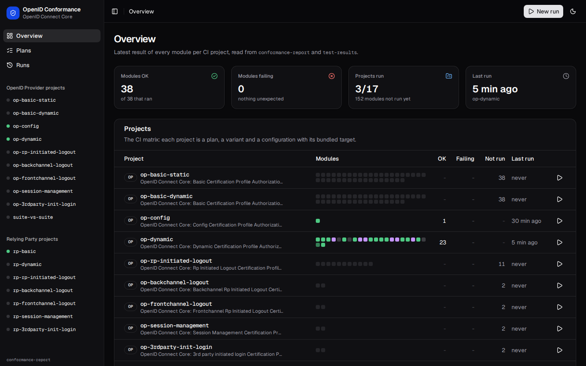
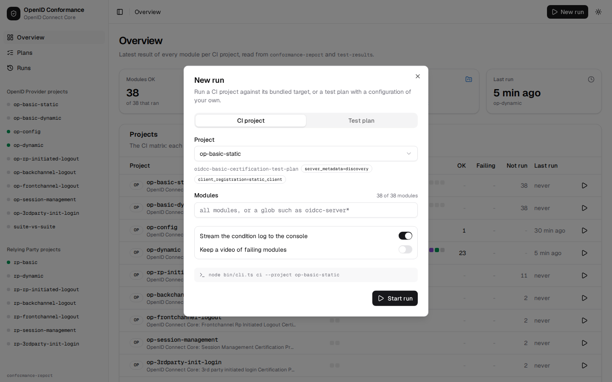
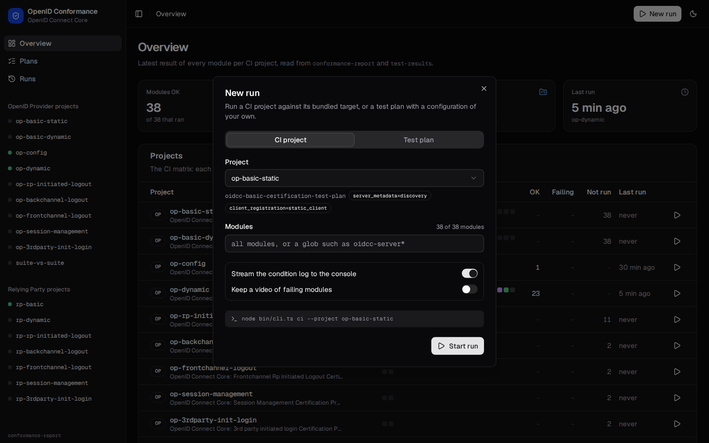
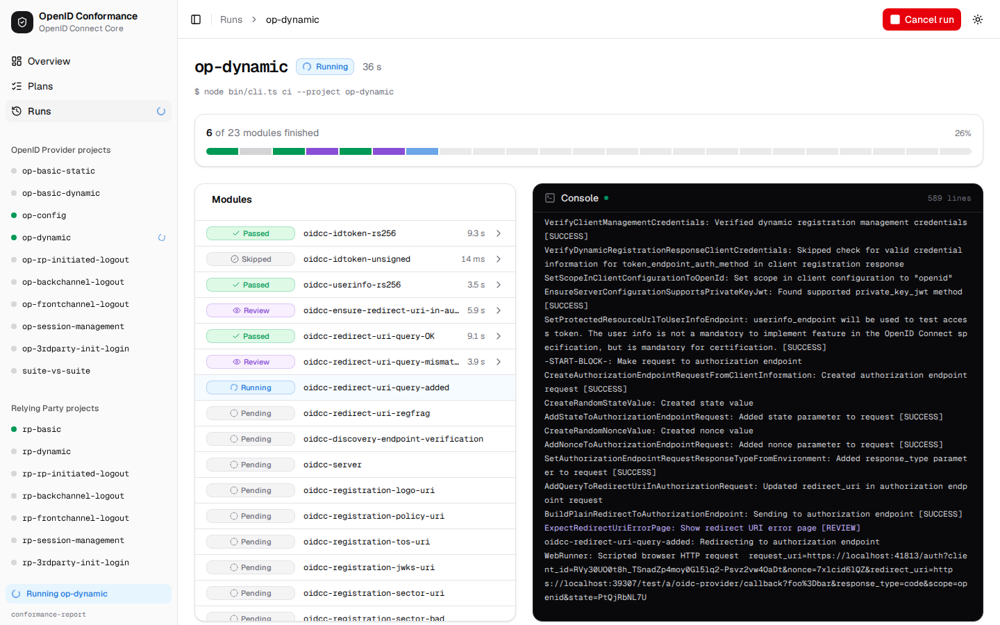
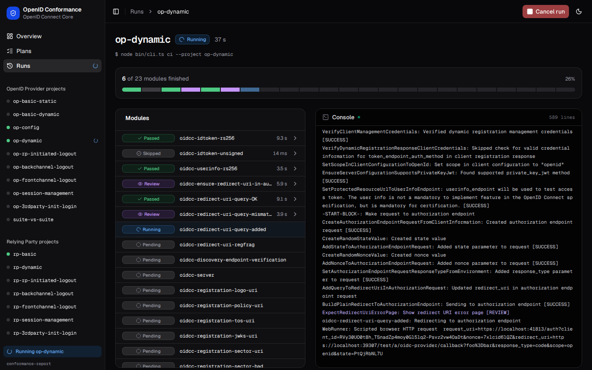
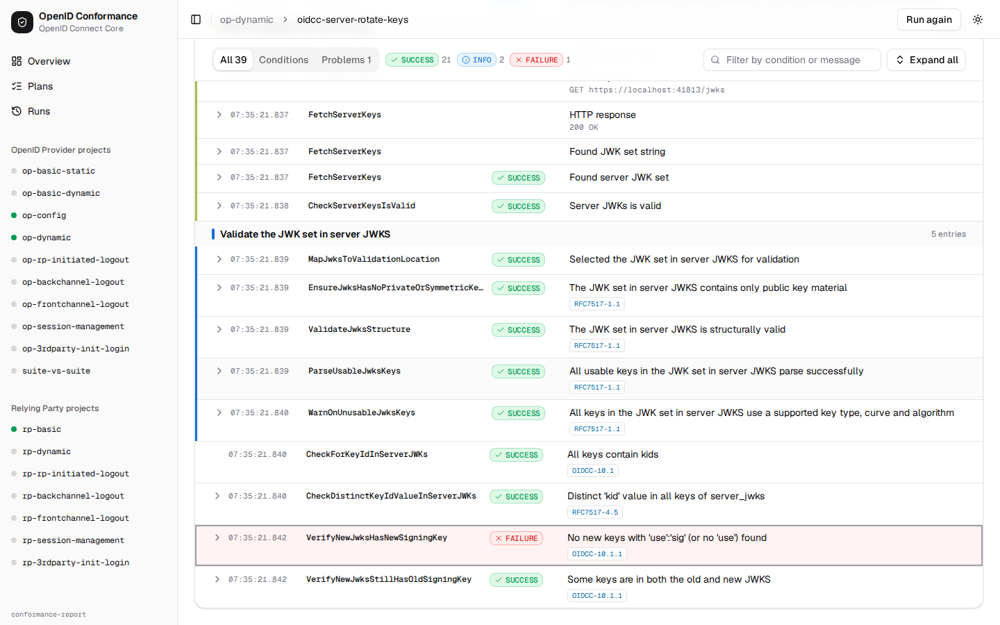
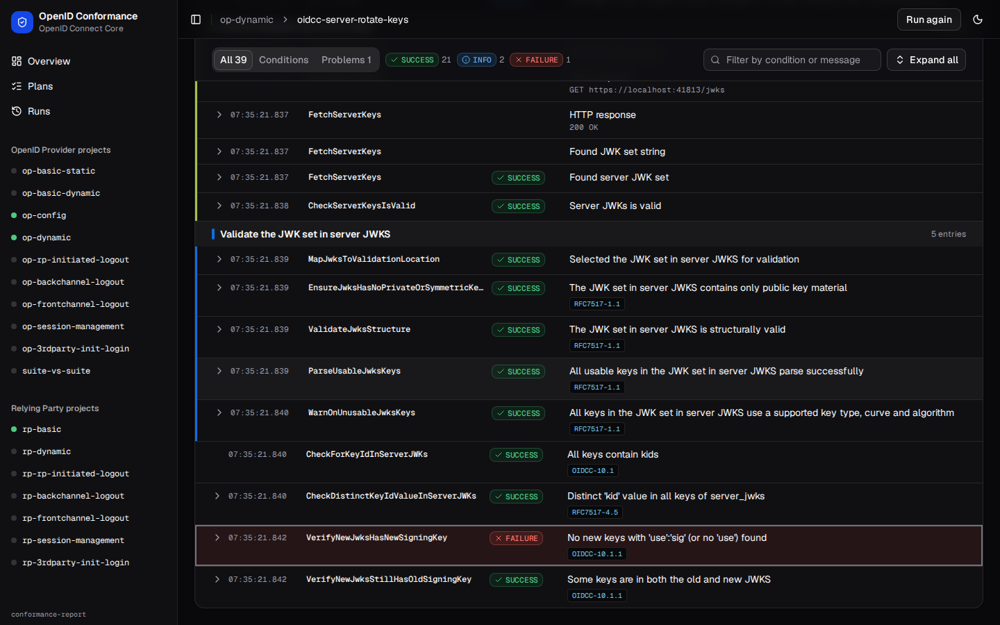
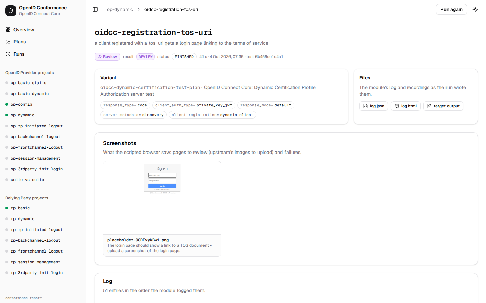
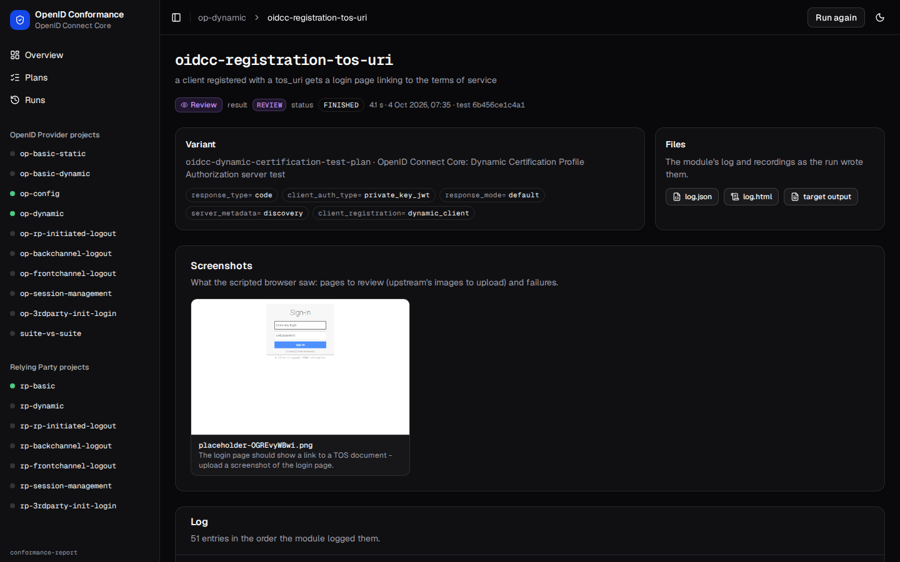

# Conformance UI

A web UI for this suite, in the spirit of the official suite's
([certification.openid.net](https://www.certification.openid.net)): the plans, starting a run and following it live,
and each test module's log with its conditions, results, HTTP exchanges and screenshots. It is a local tool: it reads
the files a run leaves behind and starts runs with the suite's own CLI. There is no database and no login.


## Running it

From a checkout of this repository (Node.js 24 or newer, pnpm):

```bash
pnpm install
pnpm ui                                  # http://127.0.0.1:3000 (pnpm --filter ui dev)
node bin/cli.ts ui --port 3001 --report-dir ./my-report --results-dir ./my-results   # the same, with options
```

The UI listens on 127.0.0.1 only: it starts processes on your machine. Runs need Playwright's Chromium like any run
(`pnpm exec playwright install chromium`).

| Environment / CLI option                     | Default               | What it is                                                                                          |
| -------------------------------------------- | --------------------- | --------------------------------------------------------------------------------------------------- |
| `CONFORMANCE_REPORT_DIR` / `--report-dir`    | `conformance-report/` | `results.json` and `summary.md` (the suite's reporter); the UI keeps `ui-runs.json` and a lock here |
| `CONFORMANCE_RESULTS_DIR` / `--results-dir`  | `test-results/`       | Playwright's output: each module's `log.json`, `log.html`, `module-report.json`, screenshots        |
| `CONFORMANCE_UI_CWD` (the CLI's working dir) | the repository        | where runs start, so a config's `target.command` runs where you expect                              |
| `CONFORMANCE_UI_ROOT`                        | found from the cwd    | the suite's checkout (`bin/cli.ts`, `src/runner/projects.ts`)                                       |

Results of runs started from the command line (`node bin/cli.ts ci --project op-config`) show up too.

### Hosted (read-only) mode

On Vercel there is no checkout to start `node bin/cli.ts ci` from, no Playwright and no long-running process, so the UI
has a second mode: it serves the results bundled under `ui/sample-data/` instead of a report directory and starts
nothing. It is chosen with `CONFORMANCE_UI_MODE=static`, or automatically when `VERCEL` is set (Vercel sets it at build
and run time); `CONFORMANCE_UI_MODE=local` turns it off again.

```bash
pnpm --filter ui build
CONFORMANCE_UI_MODE=static pnpm --filter ui start   # the demo, locally (the mode is read when the server starts)
```

In this mode the overview, plans, projects, runs history and module log views, the screenshots, `log.json` / `log.html`
and the theme work as in the local one. What differs: a banner says it is a read-only demo; every run control (the
New run button, the per-project and per-module play buttons, "Run again", the `n` shortcut) is visible but disabled with
the tooltip "runs need a local checkout: pnpm ui"; `POST /api/runs` (and `DELETE /api/runs/<id>`) answer `405` with
`{"error": "runs need a local checkout: pnpm ui"}`; the sidebar does not poll for an active run; the bundled results are
scanned once per server instance. `CONFORMANCE_REPORT_DIR` / `CONFORMANCE_RESULTS_DIR` still win over the bundle, so
`CONFORMANCE_UI_MODE=static` with those two is also a read-only viewer for any report.

`ui/sample-data/` is a real report (3.5 MB): `rp-basic`, `op-config` and `op-dynamic` run against the bundled targets.
It is `report/` (`results.json`, `summary.md`, `ui-runs.json` for the runs history),
`results/<project>/<run>/<test dir>/` (`module-report.json`, `log.json` minified, `log.html.gz` served as `log.html`,
`target-output.txt`, screenshots; no videos, traces or Playwright's `attachments` copies) and `manifest.json` (when each
module finished: file times do not survive a checkout). Refresh it from the repository root:

```bash
rm -rf test-results conformance-report
for p in rp-basic op-config op-dynamic; do
  CONFORMANCE_VIDEO=off CONFORMANCE_TRACE=off PLAYWRIGHT_TEST_OUTPUT_DIR=$PWD/test-results/$p/sample \
    node bin/cli.ts ci --project $p
done
pnpm --filter ui sample-data       # node scripts/sample-data.ts: copies, strips, writes ui-runs.json and manifest.json
```

## What it does

|                           |                                                                                                                                                                                                                                                                                                                                                                                                                                                                                                                         |
| ------------------------- | ----------------------------------------------------------------------------------------------------------------------------------------------------------------------------------------------------------------------------------------------------------------------------------------------------------------------------------------------------------------------------------------------------------------------------------------------------------------------------------------------------------------------- |
| `/`                       | Overview: totals, every CI project with one square per module coloured by its latest result (hover for the module, click for its log), what needs attention (failures, warnings, screenshots to review).                                                                                                                                                                                                                                                                                                                |
| `/plans`, `/plans/<plan>` | The plans from `src/runner/projects.ts`: title, spec, variant parameters and their values, CI projects, and the latest result of each module in any variant.                                                                                                                                                                                                                                                                                                                                                            |
| `/projects/<name>`        | A CI project: plan, variant, configuration, skipped modules, and each module's latest result with its condition counts; run the project or one module.                                                                                                                                                                                                                                                                                                                                                                  |
| New run (`n`)             | A dialog: a CI project, or a plan with a configuration (the `configs/` files are suggested, any path works), its variant values, a module glob, https on/off; options to stream the condition log and keep videos. It shows the command it runs.                                                                                                                                                                                                                                                                        |
| `/runs/<id>`              | The run, live: per-module status (pending, running, then the module's own outcome), a progress bar, the console (the list reporter and, with the condition log on, every log entry as it is logged). Cancel stops the run's whole process group. `/runs` lists the runs.                                                                                                                                                                                                                                                |
| `/modules/<testId>`       | A module's log like upstream's log page: the entries in order under their block headings, with the condition, the result (SUCCESS, FAILURE, WARNING, INFO, REVIEW), the message, the requirements (linked to the specifications) and the details one click away (HTTP requests and responses, JSON); filters for problems and text; the screenshots; the variant, result and status; the expected-failures analysis with links to the entries; links to the raw `log.json`, `log.html`, target output, video and trace. |

Outcomes: a module whose failures the configuration expects (`expectedFailures`) is an _expected failure_ and counts as
OK, as in the suite's CI; a module the analysis did not expect is _failed_.

## How runs work

`ui/lib/runs.ts` spawns `node bin/cli.ts ci --project <name>` (or `run --plan ... --config ... --variant k=v`) in a
process group of its own. First the same command with `-- --list --reporter=json` lists the modules the run will run,
in order. During the run, the list reporter's line for each finished test marks it done and the next one running,
and the `module-report.json` each module writes (polled every second) gives its outcome and test id, so its log is
one click away while the run goes on. Everything is streamed to the browser as Server-Sent Events
(`/api/runs/<id>/events`).

Each run writes to `<results dir>/<project>/<run id>/` (Playwright empties its output directory when a run starts,
so runs must not share one; the newest five runs of a project are kept). One run at a time per report directory:
the active run is kept in memory and in `<report dir>/.ui-run.lock`.

`ui/lib/reports.ts` reads `results.json` and every `module-report.json` under the results directory; the newest
report of a module wins, and Playwright's directory names (which end with the project name) say which project ran
it. A module only `results.json` remembers (its directory was removed) is shown without a log.

## Routes

| Route                              |                                                                      |
| ---------------------------------- | -------------------------------------------------------------------- |
| `GET /api/runs`                    | the active run's id and every run (this server's and `ui-runs.json`) |
| `POST /api/runs`                   | start a run (`RunRequest` in `lib/types.ts`); 409 while one is going |
| `GET /api/runs/<id>`, `DELETE ...` | a run with its console tail; cancel it                               |
| `GET /api/runs/<id>/events`        | the run as Server-Sent Events                                        |
| `GET /api/files/results/<path>`    | a file of the results directory (logs, screenshots, videos, traces)  |
| `GET /api/files/report/<path>`     | a file of the report directory (`results.json`, `summary.md`)        |

In the hosted mode `POST /api/runs` and `DELETE /api/runs/<id>` answer `405`.

## Deploying to Vercel

The hosted mode above makes `ui/` a normal Next.js project for Vercel: its own Vercel project with Root Directory `ui`,
inside this pnpm workspace. Nothing else is built or installed for it (`@playwright/test` is a dev dependency of the
screenshot script only; the functions never start Playwright), and `outputFileTracingIncludes` in `next.config.ts` ships
`ui/sample-data/` with every route. Set it up through Vercel's Git integration:

### Vercel's Git integration (recommended)

1. In the Vercel dashboard: Add New... > Project > import this repository from GitHub.
2. Before deploying, set (on the import screen, or Settings > Build and Deployment / Environment Variables):

   | Setting                                                         | Value                                                                                                                                            |
   | --------------------------------------------------------------- | ------------------------------------------------------------------------------------------------------------------------------------------------ |
   | Framework Preset                                                | Next.js (detected from `ui/package.json`; `ui/vercel.json` says so too)                                                                          |
   | Root Directory                                                  | `ui`                                                                                                                                             |
   | Include source files outside of the Root Directory in the Build | enabled (the default): the UI imports `../src/runner/projects.ts`, and the root lockfile and workspace file are outside `ui`                     |
   | Build Command, Output Directory                                 | the defaults (`next build`, Next.js's)                                                                                                           |
   | Install Command                                                 | the default, not overridden: Vercel finds `pnpm-lock.yaml` and `pnpm-workspace.yaml` in the repository root and installs the workspace with pnpm |
   | Node.js Version                                                 | 24.x (`ui/package.json` has `engines.node >= 24`)                                                                                                |
   | Environment Variable `ENABLE_EXPERIMENTAL_COREPACK`             | `1`: from the lockfile format alone Vercel picks pnpm 9 or 10; this makes it use the root `package.json`'s `packageManager` (`pnpm@12.8.1`)      |
   | Production Branch                                               | `main` (the default)                                                                                                                             |
   | Skip deployment (Root Directory section)                        | optional: skips commits that touch nothing the project depends on                                                                                |

   No other environment variable is needed: `VERCEL`, which Vercel sets, selects the hosted mode.

3. Deploy. From then on every push to `main` is a production deployment, and every pull request (and other branch) gets
   a preview URL that Vercel comments on the pull request.

## Screenshots

`node scripts/screenshots.ts --url http://127.0.0.1:3000 --start op-dynamic` (with the UI running) starts a run,
shoots it in progress, waits for it and shoots the other pages, light and dark:

|                                                                        |                                                                      |
| ---------------------------------------------------------------------- | -------------------------------------------------------------------- |
|                             |                             |
|                         |                         |
|                    |                    |
|        |        |
|  |  |

## Code

Next.js (App Router) with shadcn/ui (`components/ui`, generated) and Tailwind. Pages are server components that read
the files directly; the client components are the run dialog, the live run, the log view, the sidebar and the
screenshot gallery. `lib/` is the server side: `mode.ts` (hosted or local), `paths.ts` (directories), `catalog.ts` (plans and projects from
`../src/runner/projects.ts`, configs), `reports.ts`, `runs.ts`; `types.ts` and `format.ts` are shared with the
client. The report shapes are the suite's own types (`src/suite/report.ts`, `expected.ts`, `log.ts`).
`pnpm check` at the root typechecks, lints and formats the UI too.
